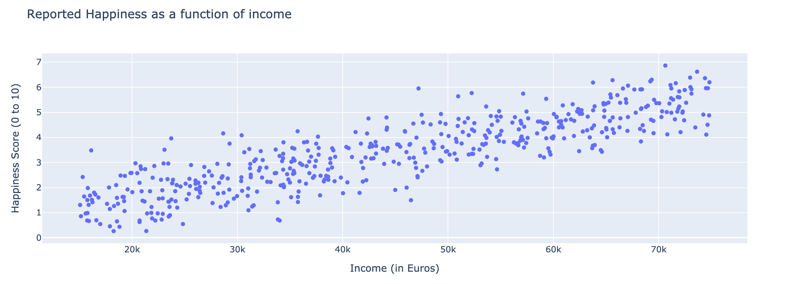

# Linear Regression

So far, we have only looked as *classification* models for machine learning. Let's take a dive into **regression** models, starting with Linear Regression.

## Mo' Money, Less Problems?

You collected a bunch of survey data measuring the happiness levels of people with varying levels of income, hoping to see if there is any correlation. Questions whether money DOES equal happiness, you decide to graph it:

## Income vs. Happiness Data

Unfortunately, you were only able to get those with an income up to $50k. 

Based on this, what do you think the happiness score of someone around $70k income look like?

## More Surveying

There you have it. Looks like your prediction was correct! It seems to follow a **linear** pattern/correlation, which is the basis of linear regression. Let's keep looking at more data.

## Even More Surveying

Be careful to not overextend your predictions with linear regression because it may not *always* follow a linear trend.

With that, let's hop into some coding!
<!-- Start with introducing a simple concept. Line of best fit on calculators? "Predict" a certain value. Speak about RMSE. Housing data? Medical Chargers data? Multiple weights. Feature/weight importance. -->

## Coding Time!